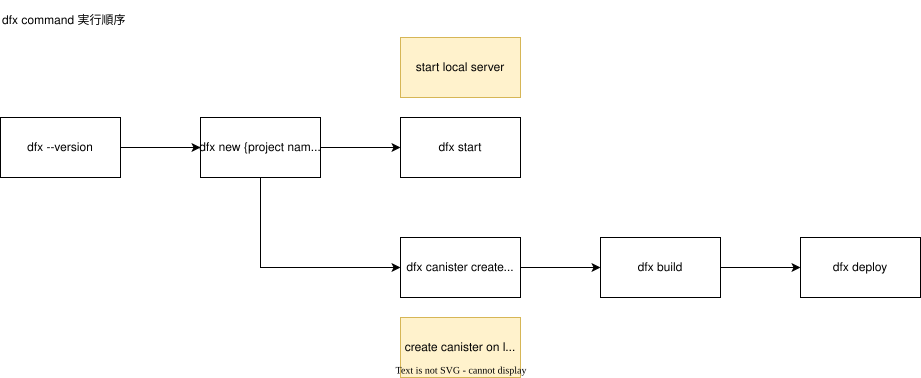

### Mac M1



```
sh -ci "$(curl -fsSL https://internetcomputer.org/install.sh)"
```

```
dfx --version
```

dfx 0.24.3


#### create project name

```
dfx new {project name} --type=rust
```

example : 

```
dfx new testproj02 --type=rust
```

```
cd testproj02
```


## run local server

```
% dfx start

Running dfx start for version 0.24.3
Using the default configuration for the local shared network.
Initialized replica.
Initialized HTTP gateway.
Replica API running on 127.0.0.1:4943
Success! The dfx server is running.
You must open a new terminal to continue developing. If you'd prefer to stop, quit with 'Ctrl-C'.
```

#### create canister, build, deploy

open new terminal.

```
% dfx canister create --all
Creating canister testproj02_backend...
testproj02_backend canister created with canister id: a4tbr-q4aaa-aaaaa-qaafq-cai
Creating canister testproj02_frontend...
testproj02_frontend canister created with canister id: ajuq4-ruaaa-aaaaa-qaaga-cai
```

```
dfx build
```

If you need to install wasm32, execute below command.

```
rustup target add wasm32-unknown-unknown
```

when above command success, re-execute below command.
 
```
dfx build
```

deploy to local server.


```
dfx deploy
```


---------

# specific port , update canister


dfx new testproj02_update_canister --type=rust

```
dfx start --host 127.0.0.1:7001
```


cd testproj02_port
dfx canister create --all

dfx build
dfx deploy


dfx stop

dfx start --host 127.0.0.1:7001 --clean


onmac/testproj02_port/src/testproj02_port_backend/src/lib.rs
に記載したら、Candid file に反映されないのか

https://internetcomputer.org/docs/current/developer-docs/backend/rust/generating-candid


[dependencies]
ic-cdk = "0.17.1"

cargo install candid-extractor

-----


update code


`dfx generate` will generate type declarations for all canisters declared in dfx.json.


dfx canister install --mode upgrade

----------


dfx canister create testproj02_frontend
dfx canister create testproj02_backend
dfx build
dfx start --clean --host 127.0.0.1:8001

dfx build
dfx start  --clean --background

dfx build

dfx canister create testproj02_backend

dfx canister create testproj02_frontend


```
hiroshi@hiroshinoMac-mini testproj02 % dfx help
The DFINITY Executor

Usage: dfx [OPTIONS] <COMMAND>

Commands:
  build       Builds all or specific canisters from the code in your project. By default, all
                  canisters are built
  cache       Manages the dfx version cache
  canister    Manages canisters deployed on a network replica
  completion  Generate a shell completion script
  cycles      Helper commands to manage the user's cycles
  deploy      Deploys all or a specific canister from the code in your project. By default, all
                  canisters are deployed
  deps        Pull dependencies and integrate locally
  diagnose    Detects known problems in the current environment caused by upgrading DFX, and
                  suggests commands to fix them. These commands can be batch-run automatically via
                  `dfx fix`
  fix         Applies one-time fixes for known problems in the current environment caused by
                  upgrading DFX. Makes no changes that would not have been suggested by `dfx
                  diagnose`
  extension   Manages the dfx extensions
  generate    Generate type declarations for canisters from the code in your project
  identity    Manages identities used to communicate with the Internet Computer network.
                  Setting an identity enables you to test user-based access controls
  info        Get information about the replica shipped with dfx, path to networks.json, and
                  network ports of running replica
  killall     Kills all dfx-related processes on the system. Useful if a process gets stuck
  ledger      Ledger commands
  new         Creates a new project
  ping        Pings an Internet Computer network and returns its status
  quickstart  Use the `dfx quickstart` command to perform initial one time setup for your
                  identity and/or wallet. This command can be run anytime to repeat the setup
                  process or to be used as an informational command, printing information about
                  your ICP balance, current ICP to XDR conversion rate, and more
  remote      Commands used to work with remote canisters
  schema      Prints the schema for dfx.json
  start       Starts the local replica and a web server for the current project
  stop        Stops the local network replica
  wallet      Helper commands to manage the user's cycles wallet
  help        Print this message or the help of the given subcommand(s)

Options:
  -v, --verbose...
          Displays detailed information about operations. -vv will generate a very large number of
          messages and can affect performance
  -q, --quiet...
          Suppresses informational messages. -qq limits to errors only; -qqqq disables them all
      --log <LOGMODE>
          The logging mode to use. You can log to stderr, a file, or both [default: stderr]
          [possible values: stderr, tee, file]
      --logfile <LOGFILE>
          The file to log to, if logging to a file (see --logmode)
      --identity <IDENTITY>
          The user identity to run this command as. It contains your principal as well as some
          things DFX associates with it like the wallet [env: DFX_IDENTITY=]
      --provisional-create-canister-effective-canister-id <PRINCIPAL>
          The effective canister id for provisional canister creation must be a canister id in the
          canister ranges of the subnet on which new canisters should be created
  -h, --help
          Print help
  -V, --version
          Print version
```


hiroshi@hiroshinoMac-mini testproj02 % dfx start
Running dfx start for version 0.24.3
Using the default configuration for the local shared network.
Initialized replica.
Initialized HTTP gateway.
Replica API running on 127.0.0.1:4943
Success! The dfx server is running.
You must open a new terminal to continue developing. If you'd prefer to stop, quit with 'Ctrl-C'.


```
hiroshi@hiroshinoMac-mini testproj02 % dfx identity new my_identity
Your seed phrase for identity 'my_identity': fantasy tree kite depend pumpkin index weekend recipe disorder duty soda build wait duty process fade outside seek ride because exile burger tool sphere
This can be used to reconstruct your key in case of emergency, so write it down in a safe place.
Created identity: "my_identity".
```

dfx identity get-wallet

hiroshi@hiroshinoMac-mini onmac % dfx identity get-wallet
Creating a wallet canister on the local network.
The wallet canister on the "local" network for user "default" is "by6od-j4aaa-aaaaa-qaadq-cai"
by6od-j4aaa-aaaaa-qaadq-cai


dfx canister create --all
hiroshi@hiroshinoMac-mini testproj02 % 
dfx canister create --all
Creating canister testproj02_backend...
testproj02_backend canister created with canister id: avqkn-guaaa-aaaaa-qaaea-cai
Creating canister testproj02_frontend...
testproj02_frontend canister created with canister id: asrmz-lmaaa-aaaaa-qaaeq-cai

dfx build

rustup target add wasm32-unknown-unknown

dfx build


dfx deploy


hiroshi@hiroshinoMac-mini testproj02 % dfx deploy
Deploying all canisters.
All canisters have already been created.
Building canisters...
WARN: Cannot check for vulnerabilities in rust canisters because cargo-audit is not installed. Please run 'cargo install cargo-audit' so that vulnerabilities can be detected.
Executing: cargo build --target wasm32-unknown-unknown --release -p testproj02_backend --locked
    Finished `release` profile [optimized] target(s) in 0.12s
Building frontend...
WARN: Generating type declarations for canister testproj02_frontend:
  /Users/hiroshi/projects/github/infinith4/dev-icp/onmac/testproj02/src/declarations/testproj02_frontend/testproj02_frontend.did.d.ts
  /Users/hiroshi/projects/github/infinith4/dev-icp/onmac/testproj02/src/declarations/testproj02_frontend/testproj02_frontend.did.js
  /Users/hiroshi/projects/github/infinith4/dev-icp/onmac/testproj02/src/declarations/testproj02_frontend/testproj02_frontend.did
Generating type declarations for canister testproj02_backend:
  /Users/hiroshi/projects/github/infinith4/dev-icp/onmac/testproj02/src/declarations/testproj02_backend/testproj02_backend.did.d.ts
  /Users/hiroshi/projects/github/infinith4/dev-icp/onmac/testproj02/src/declarations/testproj02_backend/testproj02_backend.did.js
  /Users/hiroshi/projects/github/infinith4/dev-icp/onmac/testproj02/src/declarations/testproj02_backend/testproj02_backend.did
DEPRECATION WARNING: The legacy JS API is deprecated and will be removed in Dart Sass 2.0.0.

More info: https://sass-lang.com/d/legacy-js-api


Installing canisters...
Creating UI canister on the local network.
The UI canister on the "local" network is "a3shf-5eaaa-aaaaa-qaafa-cai"
Installing code for canister testproj02_backend, with canister ID avqkn-guaaa-aaaaa-qaaea-cai
Installing code for canister testproj02_frontend, with canister ID asrmz-lmaaa-aaaaa-qaaeq-cai
Uploading assets to asset canister...
WARN: This project uses the default security policy for some assets. While it is set up to work with many applications, it is recommended to further harden the policy to increase security against attacks like XSS.
WARN: To get started, have a look at 'dfx info canister-security-policy'. It shows the default security policy along with suggestions on how to improve it.
WARN: Unhardened assets: all
WARN: To disable the policy warning, define "disable_security_policy_warning": true in .ic-assets.json5.
Fetching properties for all assets in the canister.
Done fetching properties for all assets in the canister. Took 203µs
Starting batch.
Staging contents of new and changed assets in batch 1:
  /index.html 1/1 (437 bytes) sha 1c827db833359d05c52de6a05d445b169de87de514a77709e30d4d03b6636088 
  /index.html (gzip) 1/1 (302 bytes) sha 7b83bef0bf6b7a4de399e24ab124fe04ce64331076cc2061ede910c5d04a06dd 
  /favicon.ico 1/1 (15406 bytes) sha 4e8d31b50ffb59695389d94e393d299c5693405a12f6ccd08c31bcf9b58db2d4 
  /assets/index-2a8a0c6e.css 1/1 (386 bytes) sha 2a8a0c6efd388558fb59f2c3bcbf755c959b07d513139f8056b25b19a2d89de5 
  /assets/index-2a8a0c6e.css (gzip) 1/1 (264 bytes) sha 5cd712f8526579207fc695820665f333f77a1e562eae4693c282ef28d9c69b74 
  /assets/index-6cbdf0aa.js 1/1 (277928 bytes) sha 1d9598ef92f709f4f4c3298a0f51345983230531b534e9d8ff60f77f84be2c88 
  /assets/index-6cbdf0aa.js (gzip) 1/1 (92888 bytes) sha d32f950e87ce79a50f8271b3f639b2f22720e95b316f5129b939e787eba34d58 
  /assets/logo2-037eb7ae.svg 1/1 (15139 bytes) sha 037eb7ae523403daa588cf4f47a34c56a3f5de08a5a2dd2364839e45f14f4b8b 
Committing batch.
Committing batch with 13 operations.
Deployed canisters.
URLs:
  Frontend canister via browser
    testproj02_frontend:
      - http://127.0.0.1:4943/?canisterId=asrmz-lmaaa-aaaaa-qaaeq-cai
      - http://asrmz-lmaaa-aaaaa-qaaeq-cai.localhost:4943/
  Backend canister via Candid interface:
    testproj02_backend: http://127.0.0.1:4943/?canisterId=a3shf-5eaaa-aaaaa-qaafa-cai&id=avqkn-guaaa-aaaaa-qaaea-cai
